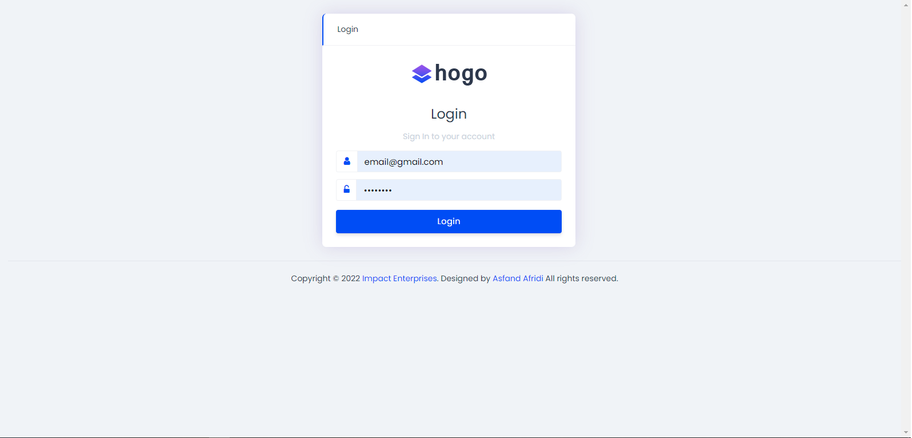
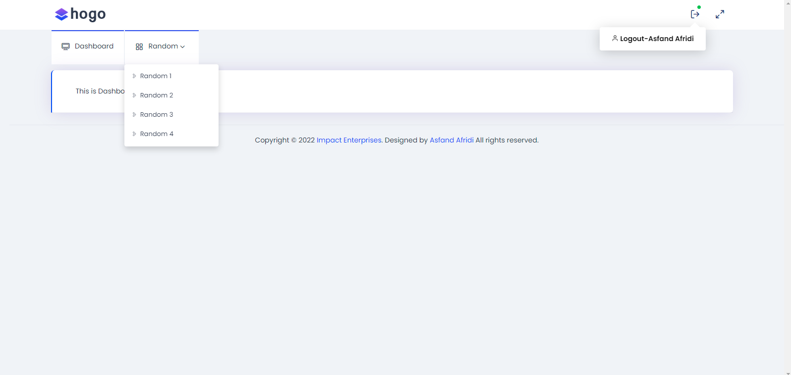

## LoginPage

## HomePage

## About LaravelHogo
LaravelHogo is a Laravel based web application Starter Template created by Asfand Afridi
Laravel is accessible, powerful, and provides tools required for large, robust applications.\\

## Contributing
Thank you for considering contributing to the LaravelHogo! 
Qudrat Agha

## Free Bootstrap Hogo Admin Template
LaravelHogo provides free Bootstrap Hogo Admin Template have tons of elements and widgets inside public/assets/plugins

## Download Hogo Theme For Free
To Download Bootstrap HOGO Theme for Free <a href="https://github.com/Asfandyarkhanafridi/hogotheme">Click Here</a>

## How to Get Started
1. Clone this Repository.
2. Run: "Composer update" inside this repository.
3. Create Database in your localhost.
4. Check .env file.
5. Run: "php artisan migrate:fresh --seed".
6. Login with  
    email: "email@gmail.com" 
    password: "12345678". 
7. Ready to Go.....

## Contact 
You can reach me via LinkedIn. <a href="https://www.linkedin.com/in/asfand-afridi-b47b54124/">Click Here</a>  
Or you can also email me at <a href="mailto:masfandy9@gmail.com">masfand9@gmail.com</a>  
